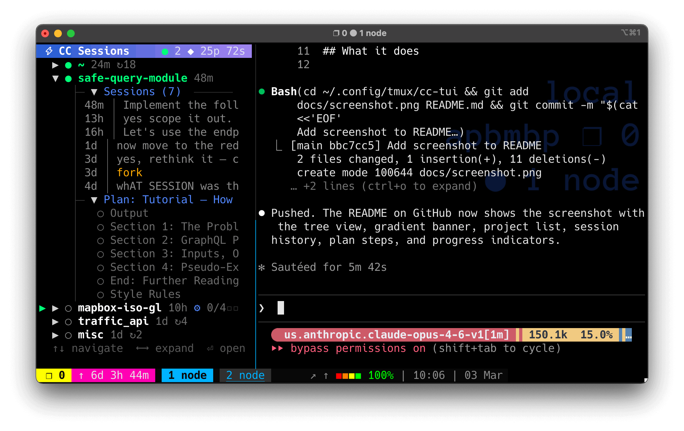

# cc-tui

A tmux-integrated TUI dashboard for managing [Claude Code](https://docs.anthropic.com/en/docs/claude-code) sessions.

Monitors `~/.claude/` for active and historical conversations, displays them in a navigable tree with live progress indicators, and lets you resume any session in a new tmux pane with a single keystroke.

> **Pre-release** — works well for daily use but expect rough edges.



## What it does

- **Tree view** of all Claude Code projects, grouped by directory
- **Live status** — active sessions show a green dot, with plan/task/todo progress bars
- **Session history** — browse and resume any past conversation, not just the latest
- **Preview** — read full conversation history inline without leaving the TUI
- **Filter** — live search across projects, sessions, and messages
- **tmux actions** — open sessions in splits, new windows, or switch to active panes
- **Background daemon** — watches `~/.claude/` for changes via fsnotify, serves the TUI over a Unix socket

## Requirements

- **macOS** or **Linux/WSL** (Windows users: see [Windows/WSL section](#windows--wsl))
- **Go 1.23+** (to build)
- **tmux** (the TUI runs inside tmux and spawns panes)
- **Claude Code** (`claude` CLI must be in your PATH)

## Install

### Quick start (macOS)

```sh
git clone https://github.com/thunderballfists/cc-tui.git ~/.config/tmux/cc-tui
cd ~/.config/tmux/cc-tui
./install.sh
```

The install script detects your platform and will:
1. Build the Go binary
2. Install a background daemon (launchd on macOS, systemd on Linux/WSL)
3. Install the tmux toggle script
4. Add a suggested tmux keybinding (if not already present)

### Manual install (macOS)

```sh
# Build
cd ~/.config/tmux/cc-tui
go build -o cc-tui .

# Install daemon (runs in background, watches ~/.claude/)
cp com.cc-tui.daemon.plist ~/Library/LaunchAgents/
# Edit the plist to replace __INSTALL_DIR__ and __HOME__ with actual paths
launchctl load ~/Library/LaunchAgents/com.cc-tui.daemon.plist

# Add tmux keybinding (see Keybindings section below)
```

## Windows / WSL

cc-tui requires tmux, which doesn't run natively on Windows. Use **WSL** (Windows Subsystem for Linux) — if you're running Claude Code on Windows, you likely already have it.

### Setup

1. **Install WSL** (if you haven't already):
   ```powershell
   wsl --install
   ```

2. **Inside WSL**, install dependencies:
   ```sh
   sudo apt update
   sudo apt install tmux golang-go
   ```

3. **Clone and install**:
   ```sh
   git clone https://github.com/thunderballfists/cc-tui.git ~/.config/tmux/cc-tui
   cd ~/.config/tmux/cc-tui
   ./install.sh
   ```

   The install script detects WSL and installs a **systemd user service** instead of launchd.

4. **Enable lingering** so the daemon survives after you close your terminal:
   ```sh
   sudo loginctl enable-linger $USER
   ```

### WSL notes

- Claude Code stores sessions in `~/.claude/` inside WSL — cc-tui reads from there
- The daemon runs as a systemd user service (`cc-tui-daemon.service`)
- Everything else (tmux keybindings, TUI usage) works identically to macOS
- Use **Windows Terminal** for best results (good true-color and unicode support)

### Managing the daemon on Linux/WSL

```sh
# Check status
systemctl --user status cc-tui-daemon

# Restart after rebuilding
systemctl --user restart cc-tui-daemon

# View logs
journalctl --user -u cc-tui-daemon -f
# Or: tail -f ~/.claude/cc-tui-stderr.log
```

## tmux setup

If you're not already using tmux, install it first:

```sh
# macOS
brew install tmux

# Ubuntu/Debian/WSL
sudo apt install tmux
```

Minimal `~/.tmux.conf` to get started:

```tmux
# Enable mouse support (scrolling, clicking, resizing panes)
set -g mouse on

# True color support
set -g default-terminal "tmux-256color"
set -as terminal-overrides ",*:Tc"

# Increase scrollback
set -g history-limit 50000

# Start windows/panes at 1 instead of 0
set -g base-index 1
setw -g pane-base-index 1

# cc-tui toggle (prefix + s)
bind s run-shell "~/.config/tmux/cc-tui-toggle.sh"
```

Then start tmux with `tmux` or `tmux new -s main`.

## Keybindings

### tmux keybinding to toggle cc-tui

The install script adds this to your `~/.tmux.conf`:

```tmux
bind s run-shell "~/.config/tmux/cc-tui-toggle.sh"
```

Press `<prefix> s` (default prefix is `Ctrl-b`) to toggle the session panel on/off.

### iTerm2 keybinding (macOS, recommended)

If you use iTerm2, you can bind a key (e.g., `Cmd+S`) to send the tmux User key sequence directly, bypassing the prefix:

1. Open **iTerm2 > Settings > Profiles > Keys > Key Mappings**
2. Click **+** to add a mapping
3. Set the shortcut (e.g., `Cmd+S`)
4. Action: **Send Escape Sequence**
5. Value: `[20~` (this sends the `User7` key that tmux recognizes)

Then add this to your `~/.tmux.conf` (no prefix needed):

```tmux
bind -T root User7 run-shell "~/.config/tmux/cc-tui-toggle.sh"
```

Other useful iTerm2 → tmux bindings you might want:

| Shortcut | Escape Sequence | tmux Binding | Action |
|----------|----------------|--------------|--------|
| `Cmd+S` | `[20~` | `User7` | Toggle cc-tui |
| `Cmd+D` | `[23~` | `User0` | Split pane right |
| `Cmd+Shift+D` | `[24~` | `User1` | Split pane left |
| `Cmd+W` | `[28~` | `User4` | Close pane |
| `Cmd+R` | `[29~` | `User5` | Reload tmux config |

### TUI keys

| Key | Action |
|-----|--------|
| `↑`/`↓` | Navigate tree |
| `←`/`→` | Collapse/expand node |
| `Enter` | Open session (resume in tmux pane) |
| `w` | Open session in new tmux window |
| `n` | New Claude session for this project |
| `p` | Preview conversation |
| `/` | Filter projects/sessions |
| `r` | Refresh |
| `?` | Help |
| `q` | Quit |

### Preview keys

| Key | Action |
|-----|--------|
| `j`/`k` | Scroll up/down |
| `d`/`u` | Half-page down/up |
| `g`/`G` | Top/bottom |
| `/` | Search within conversation |
| `Enter` | Open this session |
| `p`/`Esc` | Close preview |

## Architecture

```
┌─────────────┐     Unix socket      ┌──────────────────┐
│   cc-tui    │ ◄──────────────────► │  cc-tui serve    │
│   (client)  │   JSON protocol      │  (daemon)        │
│   Bubble Tea│                      │                  │
└──────┬──────┘                      │  • fsnotify      │
       │                             │  • cache         │
       │ tmux commands               │  • tmux polling  │
       ▼                             └────────┬─────────┘
┌─────────────┐                               │
│    tmux     │                               │ watches
│  split/new  │                               ▼
│   window    │                      ~/.claude/projects/
└─────────────┘
```

The **daemon** (`cc-tui serve`) runs via launchd (macOS) or systemd (Linux/WSL), watches `~/.claude/` for file changes, polls tmux every 2s for active claude panes, and serves data over `~/.claude/cc-tui.sock`.

The **client** (`cc-tui`) connects to the socket, renders the TUI, and sends action commands back to the daemon which executes tmux splits/windows.

## Uninstall

### macOS

```sh
launchctl unload ~/Library/LaunchAgents/com.cc-tui.daemon.plist
rm ~/Library/LaunchAgents/com.cc-tui.daemon.plist
rm -rf ~/.config/tmux/cc-tui
# Remove the keybinding line from ~/.tmux.conf
```

### Linux/WSL

```sh
systemctl --user stop cc-tui-daemon
systemctl --user disable cc-tui-daemon
rm ~/.config/systemd/user/cc-tui-daemon.service
systemctl --user daemon-reload
rm -rf ~/.config/tmux/cc-tui
# Remove the keybinding line from ~/.tmux.conf
```

## License

GPL-3.0 — see [LICENSE](LICENSE) for details.
